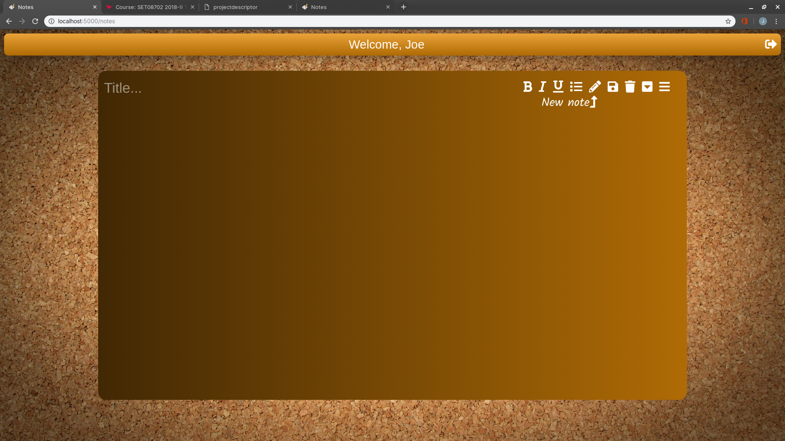
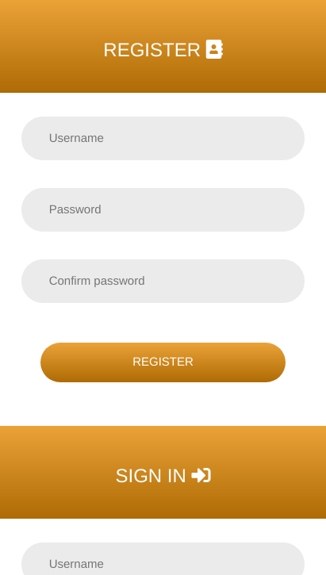
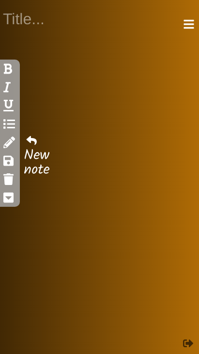
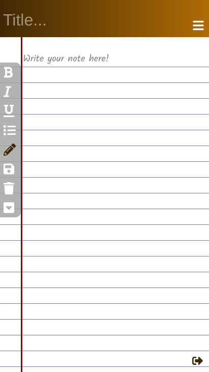
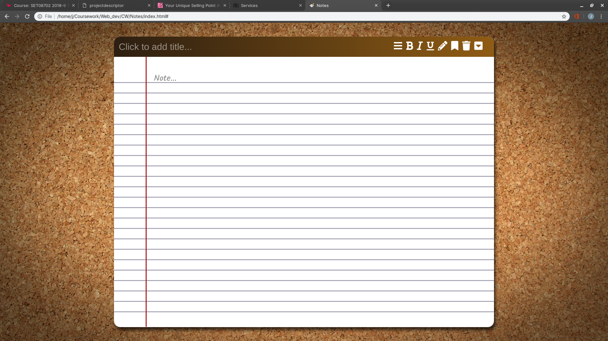
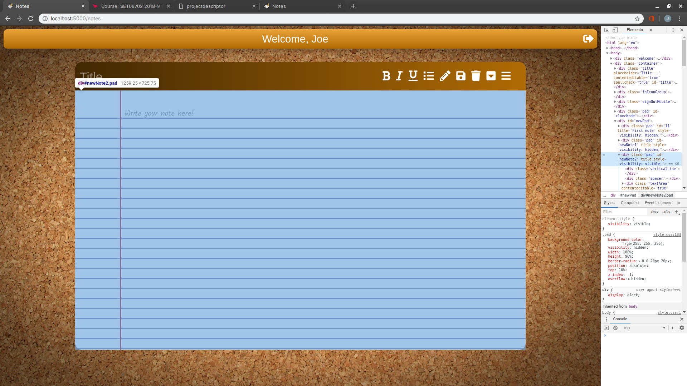
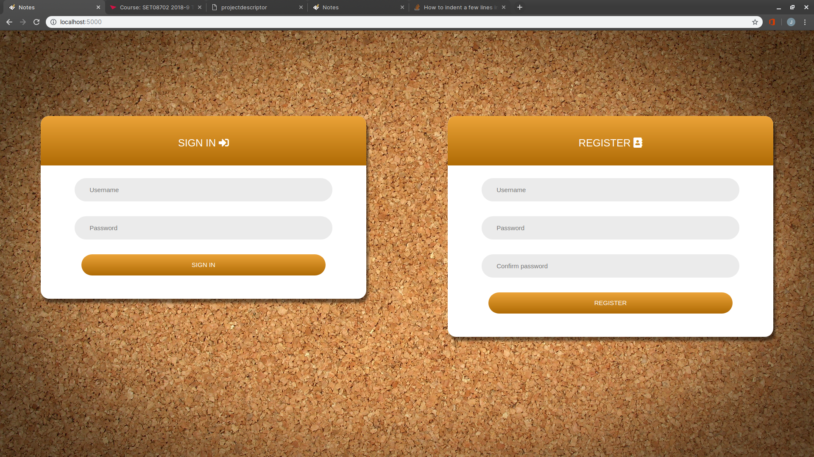
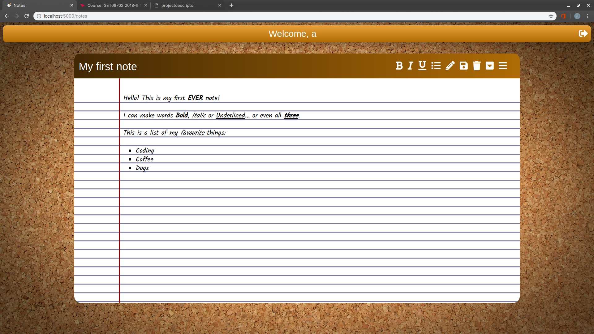
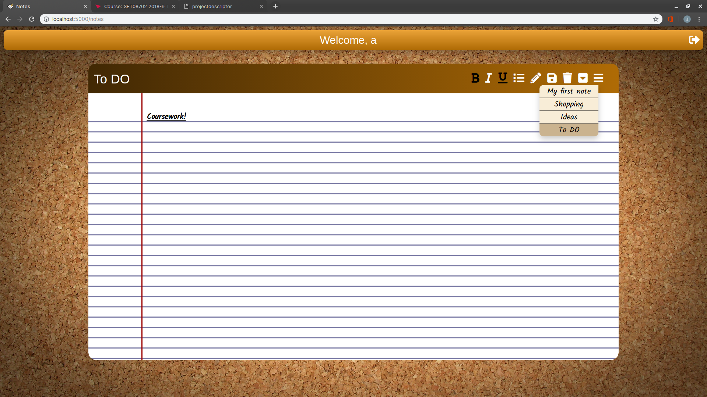

<center>

# SET08702 2018-9 TR2 001 - Web Technologies

## CW Report part ii
</center>

> Joe L, 40417692

---

## Contents

- [SET08702 2018-9 TR2 001 - Web Technologies](#SET08702-2018-9-TR2-001---Web-Technologies)
  - [CW Report part ii](#CW-Report-part-ii)
  - [Contents](#Contents)
    - [Introduction](#Introduction)
    - [Development from my initial plan](#Development-from-my-initial-plan)
      - [SQL DB](#SQL-DB)
      - [Login page](#Login-page)
    - [Challenges](#Challenges)
      - [jQuery and ajax](#jQuery-and-ajax)
      - [Sessions](#Sessions)
      - [Text formatting buttons - Bold, Underline, Italic and List](#Text-formatting-buttons---Bold-Underline-Italic-and-List)
      - [Features](#Features)
    - [Conclusion](#Conclusion)
  - [Appendix](#Appendix)
    - [Figure 1](#Figure-1)
    - [Figure 2](#Figure-2)
    - [Figure 3](#Figure-3)
    - [Figure 4](#Figure-4)
    - [Figure 5](#Figure-5)
    - [Figure 6](#Figure-6)
    - [Figure 7](#Figure-7)
  - [Usage](#Usage)

<div style="page-break-after: always;"></div>

### Introduction

The front-end of my note-taking web application has mostly remained unchanged from the initial design and prototype. In this report I will discuss the development process, the challenges I have faced and what features I have managed to implement into the final version of this note-taking web application through the use of the **SQL** database platform, **Javascript** and **jQuery**.

---

### Development from my initial plan

The first part of this coursework was to design and implement a prototype user interface for a note-taking web application. _Figure 1_ is a capture of this initial design. Note that my main goal for this design was to be user-friendly, easy to use and aesthetically appealing. I achieved this through the use of minimal HTML with the aim of simplifying the application, and extensive CSS code that took care of the aesthetics.

At first, there does not seem to be much of a difference between this prototype and the final version of my web application. Some subtle changes may be that I have changed the position of some buttons, changed the note shape and added a list feature. In reality the final version of my web application has been completely re-written.

There were two major reasons for doing this. One was to make the web application more mobile friendly. The other was to make sure that loading in a new note could be made easier.

<center>

> **Notepad**
</center>

In order to easily save and generate new notes, I decided to re-think the layout of my web application. Before the container that housed every element within it was the white text area. Now the container that houses everything within it is the brown and yellow background that can be seen in the top bar.

<center>

</center>

_Figure 2_ shows the notepad and how it is now separate from the container of the web application.

<div style="page-break-after: always;"></div>

<center>

> **Mobile compatibility**
</center>

One goal for the development of my application was to make it more mobile-friendly. I think I have achieved this because the application maintains it's simplistic look and appeal while staying functional and easy to navigate.

<center>



</center>

#### SQL DB

In order to achieve full functionality I needed to consider how to save my notes and where to save them. At first I considered using a cloud-based environment such as **MongoDB**. The benefits of using a cloud-based environment to host a database are that it is easily accessible, easily managed and expandable. Despite these benefits I decided to opt for an SQL database as I was more familiar with this environment and for the requirements of this application, I felt like this form of data logging was sufficient.

#### Login page

In order to enable the functionality of viewing and editing previously saved notes, I had to incorporate a user-based system. Therefore a login page was needed. This allows a user to sign up with their own username and password and all their notes will be saved under their own details, enabling them to log in at any time and view their notes.

_Figure 3_ shows the new sign-up and sign-in page. I tried to get this theme to match as close as possible to the theme of the not-taking application itself.

---

### Challenges

#### jQuery and ajax

Most of the challenges I faced were involving the server-side integration. I had not written jQuery before and most sources of research involved writing jQuery and ajax in order to integrate the SQL database. I therefore had to learn jQuery and ajax in order to write this coursework.

#### Sessions

Another point of difficulty was setting up the sessions for the user. I hadn't used sessions before to keep a user logged in so this was another aspect in which I had to do extra research.

#### Text formatting buttons - Bold, Underline, Italic and List

These buttons were particularly difficult to integrate as they do not work on a text area, only on a div. They also lack the consistency I desire. They only will work if the div is clicked and then the button is pressed.

In order to show the user that one of these buttons is active I tried to incorporate some Javascript that would toggle the colour of the button once clicked. This works consistently when the button is clicked, but may turn 'on' even though the text hasn't taken on the desired formatting.

---

#### Features

- User sign-up and sign-in capability.
- Personalised user "Welcome" message.
- Ability to create, save, edit and delete notes.
- Can make text within the note bold, underlined, italic or make a list.
- Can download the current note as a .html document.
- Useful balloon tags appear on the buttons when hovered over. This improves usability.
- Fully mobile and tablet friendly.

My note-taking application is fully functional and working. The user can sign-up, sign-in _(Figure 3)_, create a note and save it _(Figure 10)_. They can see all their previous notes in the drop-down menu _(Figure 11)_, delete any unwanted notes and even download the current note they are on. It will download in .html format in order to preserve the bold, underline and italic formatting. If the user is confused about how to use the application then they can hover over the buttons and a balloon will appear, describing what the button does.

One feature I am proud of is that the app is fully mobile compatible. Therefore it could be developed further into a mobile application fairly easily.

---

### Conclusion

I enjoyed making this note-taking web application. I especially enjoyed the design phase and making it aesthetically appealing. Getting it to be fully functional was very rewarding, however. If I were to do this coursework again I would maybe try a better way of displaying the saved notes to the user, possibly with another page instead of a drop-down menu. I would also migrate to a cloud-based database which would improve the admin's access and provide the opportunity for expansion.

<div style="page-break-after: always;"></div>

## Appendix

<center>

### Figure 1



> Initial design, completed for part one of the coursework.

### Figure 2



> Screenshot showing the notepad div separate from the main container.

<div style="page-break-after: always;"></div>

### Figure 3



> Sign-up and sign-in page.

### Figure 4


> Home page. The user is now logged in.

### Figure 5



> Example of a note with font formatting.

### Figure 6



> Example of drop-down menu showing saved notes.

### Figure 7


> Mobile compatibility screenshots.
</center>

<div style="page-break-after: always;"></div>

## Usage

Make sure node v12.6.0 is installed.

```sh
run $ node --version
```

Make sure npm v6.9.0 is installed.

```sh
run $ npm --version
```

Locate the /40417692_notes folder.

```sh
run $ npm install
```

This will install all the relevent packages. Once completed:

```sh
run $ node run
```

The server will start and the web application can be accessed on **localhost:5000**.