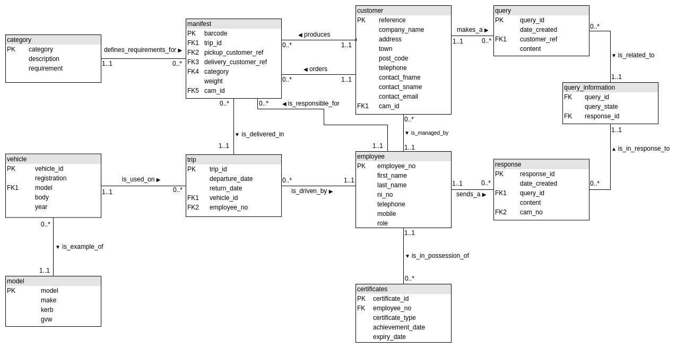
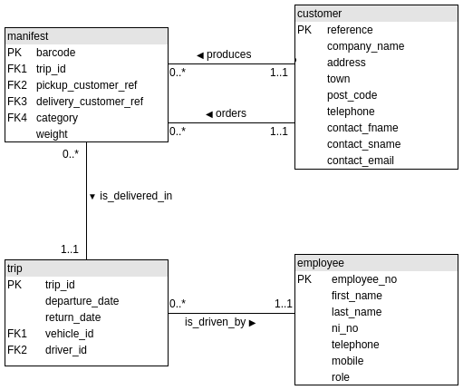

# Database Technology - SQL Haulage assignment

> Joe L, 40417692

----

## Section one - SELECT Statements

### 11. **Dangerous driving.** For all trips where hazardous goods were transported, find the percentage of each category of item in the manifest. Sort in descending order of the percentage of hazardous items. (NB results are abbreviated) (12 Marks)

**Answer:**

```sql
SELECT total.trip_id,
    CONCAT(IFNULL(ROUND(a_count.A / total.items_per_trip * 100), 0), '%') as A,
    CONCAT(IFNULL(ROUND(b_count.B / total.items_per_trip * 100), 0), '%') as B,
    CONCAT(IFNULL(ROUND(c_count.C / total.items_per_trip * 100), 0), '%') as C
FROM (
    SELECT items.trip_id, COUNT(*) as items_per_trip
        FROM (
            SELECT manifest.trip_id, manifest.category
            FROM manifest
            JOIN (
                SELECT trip_id
                FROM manifest
                WHERE category = 'C'
            ) as hazerdous_trip
            ON hazerdous_trip.trip_id = manifest.trip_id
            ORDER BY trip_id
        ) as items
        GROUP BY items.trip_id
) as total
LEFT JOIN (
    SELECT trip_id, COUNT(*) as A
        FROM (
            SELECT manifest.trip_id, manifest.category
            FROM manifest
            JOIN (
                SELECT trip_id
                FROM manifest
                WHERE category = 'C'
            ) as hazerdous_trip
            ON hazerdous_trip.trip_id = manifest.trip_id
            ORDER BY trip_id
        ) as a_items
        WHERE a_items.category = 'A'
        GROUP BY trip_id
) as a_count ON total.trip_id = a_count.trip_id
LEFT JOIN (
    SELECT trip_id, COUNT(*) as B
        FROM (
            SELECT manifest.trip_id, manifest.category
            FROM manifest
            JOIN (****
                SELECT trip_id
                FROM manifest
                WHERE category = 'C'
            ) as hazerdous_trip
            ON hazerdous_trip.trip_id = manifest.trip_id
            ORDER BY trip_id
        ) as b_items
    WHERE b_items.category = 'B'
    GROUP BY trip_id
) as b_count
ON total.trip_id = b_count.trip_id
LEFT JOIN (
    SELECT trip_id, COUNT(*) as C
        FROM (
            SELECT manifest.trip_id, manifest.category
            FROM manifest
            JOIN (
            SELECT trip_id
                FROM manifest
                WHERE category = 'C'
            ) as hazerdous_trip
            ON hazerdous_trip.trip_id = manifest.trip_id
            ORDER BY trip_id
        ) as c_items
    WHERE c_items.category = 'C'
    GROUP BY trip_id
) as c_count
ON total.trip_id = c_count.trip_id
ORDER BY c_count.C / total.items_per_trip * 100 DESC;
```

**Output:**

```sh
+---------+------+------+------+
| trip_id | A    | B    | C    |
+---------+------+------+------+
|   73832 | 44%  | 0%   | 56%  |
|   73404 | 60%  | 0%   | 40%  |
|   73773 | 63%  | 0%   | 38%  |
|   73551 | 64%  | 0%   | 36%  |
|   73013 | 67%  | 0%   | 33%  |
|   73286 | 67%  | 0%   | 33%  |
|   73382 | 67%  | 0%   | 33%  |
|   73842 | 69%  | 0%   | 31%  |
|   73353 | 69%  | 0%   | 31%  |
|   73062 | 70%  | 0%   | 30%  |
|   73745 | 70%  | 0%   | 30%  |
|   73171 | 71%  | 0%   | 29%  |
|   73611 | 57%  | 14%  | 29%  |
|   74113 | 73%  | 0%   | 27%  |
|   73779 | 74%  | 0%   | 26%  |
|   73024 | 75%  | 0%   | 25%  |
|   74083 | 77%  | 0%   | 23%  |
|   72947 | 77%  | 0%   | 23%  |
|   73100 | 81%  | 0%   | 19%  |
|   73860 | 83%  | 0%   | 17%  |
|   73431 | 83%  | 0%   | 17%  |
|   74087 | 84%  | 0%   | 16%  |
|   73022 | 85%  | 0%   | 15%  |
|   73123 | 86%  | 0%   | 14%  |
|   73960 | 88%  | 0%   | 13%  |
|   73289 | 88%  | 0%   | 13%  |
|   73757 | 88%  | 0%   | 12%  |
|   73088 | 88%  | 0%   | 12%  |
|   73032 | 88%  | 0%   | 12%  |
|   73615 | 89%  | 0%   | 11%  |
|   74101 | 91%  | 0%   | 9%   |
|   73001 | 91%  | 0%   | 9%   |
|   73451 | 93%  | 0%   | 7%   |
|   73340 | 93%  | 0%   | 7%   |
|   72944 | 67%  | 27%  | 7%   |
|   73717 | 93%  | 0%   | 7%   |
|   74013 | 94%  | 0%   | 6%   |
|   73765 | 94%  | 0%   | 6%   |
|   74024 | 94%  | 0%   | 6%   |
|   73160 | 94%  | 0%   | 6%   |
|   73504 | 78%  | 17%  | 6%   |
|   73256 | 95%  | 0%   | 5%   |
|   73957 | 95%  | 0%   | 5%   |
|   73959 | 95%  | 0%   | 5%   |
|   73194 | 95%  | 0%   | 5%   |
|   73436 | 96%  | 0%   | 4%   |
|   74059 | 96%  | 0%   | 4%   |
|   73049 | 96%  | 0%   | 4%   |
+---------+------+------+------+
```

----

### 12. **Unused trucks.** List the registration numbers of the trucks that were not in use between 1st and 5th April inclusive. ✔ (12 marks)

**Answer:**

```sql
SELECT DISTINCT all_vehicles.registration
FROM
(
    SELECT DISTINCT vehicle.registration
    FROM vehicle
    INNER JOIN trip
    ON trip.vehicle_id = vehicle.vehicle_id
) as all_vehicles
LEFT JOIN
(
    SELECT DISTINCT vehicle.registration
    FROM vehicle
    INNER JOIN trip
    ON trip.vehicle_id = vehicle.vehicle_id
    WHERE trip.departure_date <= '2012-04-01'
        AND trip.return_date BETWEEN '2012-04-01' AND '2012-04-05'
        OR trip.departure_date <= '2012-04-01' AND trip.return_date >= '2012-04-05'
        OR trip.departure_date BETWEEN '2012-04-01' AND '2012-04-05'
) as used
ON all_vehicles.registration = used.registration
WHERE used.registration IS NULL;
```

**Output:**

```sh
+--------------+
| registration |
+--------------+
| SDU 567M     |
| PY06 BYP     |
| PY61 RNU     |
| BD60BVF      |
| BD08AOF      |
+--------------+
```

----

### 13. **Bonus.** If a driver works more than 22 days in any one month, they are paid at a higher rate for the extra days. List the drivers who qualify for bonus payments for each month in the data and include the number of extra days worked. Drivers who are not eligible for a bonus should notbe shown.Order by month and number of days descending. (12 Marks)

**Answer:**

```sql
SELECT MONTHNAME(departure_date) as Month,
    CONCAT(driver.first_name, ' ', driver.last_name) as Name,
    SUM(DATEDIFF(return_date, departure_date)) as Days,
    SUM(DATEDIFF(return_date, departure_date)) - 22 as 'Bonus days'
FROM trip INNER JOIN driver ON driver.employee_no = trip.employee_no
GROUP BY Name, month
HAVING Days > '22'
ORDER BY FIELD(MONTH,'January','February','March','April','May','June','July');
```

**Output:**

```sh
+----------+-----------------------+------+------------+
| Month    | Name                  | Days | Bonus days |
+----------+-----------------------+------+------------+
| January  | Henry Cobelli         |   23 |          1 |
| January  | Igor Woodruffe        |   24 |          2 |
| February | Tristan Crumbie       |   23 |          1 |
| March    | Henry Cobelli         |   23 |          1 |
| March    | Eden Blackbrough      |   23 |          1 |
| March    | Oscar Nutten          |   27 |          5 |
| March    | Daniel Miliffe        |   26 |          4 |
| March    | Barry Thayre          |   23 |          1 |
| April    | Durant Kewzick        |   24 |          2 |
| April    | Leonardo Charlet      |   24 |          2 |
| May      | Solomon Alessandrucci |   24 |          2 |
| June     | Durant Kewzick        |   26 |          4 |
| June     | Lee Rookledge         |   28 |          6 |
+----------+-----------------------+------+------------+
```

----

### 14. **Peak week.** Find the busiest week based on the number of departures and returns. Show the start date assuming that a week starts on Monday and the number of departures and returns. (12 Marks)

**Answer:**

```sql
SELECT DATE_ADD('2011-12-26', INTERVAL a.departure_week WEEK) AS Week,
    (a.trips + b.trips) AS Movements
FROM (
    SELECT COUNT(*) AS trips,
        d.departure_week
    FROM (
        SELECT WEEK(departure_date,1) AS departure_week
        FROM trip) AS d
        GROUP BY d.departure_week)
AS a
INNER JOIN (
    SELECT COUNT(*) AS trips,
        r.return_week
    FROM (
        SELECT WEEK(return_date,1) AS return_week
        FROM trip) AS r
        GROUP BY r.return_week)
AS b
ON departure_week = return_week
ORDER BY movements DESC
LIMIT 1;
```

**Output:**

```sh
+------------+-----------+
| Week       | Movements |
+------------+-----------+
| 2012-04-02 |       105 |
+------------+-----------+
```

----

### 15. **Capacity factor.** 100% capacity is when every truck is in use every day. If some trucks are idle, the capacity factor is less than 100%. What is the total capacity factor for the company for the time period covered by the data? (12 Marks)

**Answer:**

```sql
SELECT CONCAT(IFNULL(ROUND(actual.days / possible.maximum_hours * 100), 0), '%') AS capacity
FROM (
    SELECT SUM(a.used) AS days
    FROM (
        SELECT trip_id,
        DATEDIFF(return_date, departure_date) AS used
    FROM trip)
    AS a
) AS actual
INNER JOIN (
    SELECT (total.total_possible * vehicles.vehicles_available) AS maximum_hours
    FROM (
        SELECT DATEDIFF(x.departure_date, y.departure_date) AS total_possible
        FROM (
            SELECT departure_date FROM trip ORDER BY departure_date DESC LIMIT 1
        ) AS x
        INNER JOIN (
            SELECT departure_date FROM trip ORDER BY departure_date ASC LIMIT 1
        ) AS y
    ) AS total
    INNER JOIN (
        SELECT COUNT(*) AS vehicles_available FROM vehicle
    ) AS vehicles
) AS possible;
```

**Output:**

```sh
+----------+
| capacity |
+----------+
| 43%      |
+----------+
```

----

## Section two - Database Design

### Extending the ER diagram to accomodate Customer Account Managers (CAM's)



In order to introduce a customer account manager, I had to remove the driver table as they are no-longer the only employees. I replaced the driver table with an employee table and introduced an attreibute of 'role' that will describe the role of that employee, whether they are a driver or a CAM. One unique attribute that belonged to the driver table was whether they could carry hazardous goods or not. In order to satisfy this requirment, I introduced a certificates table where this certificate, along with any additional certificates that may be acquired in the future, can be stored. So that a customer's CAM can be identified at any time, I placed a cam_id attribute in the customer table which is a direct reference to an employee number. This can also be seen in the manifest table so that any CAM can be identified as being responsible for any trip.

I have made it so that one customer has to have a CAM at all times but a CAM can manage many customers at one time. Similarly, a CAM can be responsible for many manifest items.

### Alter the database to inlcude any additional tables and attributes

```SQL
-- Adds cam_id to table.
ALTER TABLE customer
ADD cam_id INTEGER NOT NULL
AFTER contact_email;

-- Creates employee table.
CREATE TABLE employee(
    employee_no INTEGER auto_increment PRIMARY KEY,
    first_name VARCHAR(20) NOT NULL,
    last_name VARCHAR(20) NOT NULL,
    ni_no VARCHAR(13),
    telephone VARCHAR(20),
    mobile VARCHAR(20),
    role VARCHAR(6)
);

-- Makes cam_id a foreign key.
ALTER TABLE customer
ADD FOREIGN KEY (cam_id)
REFERENCES employee(employee_no);

-- Adds cam_id to manifest table.
ALTER TABLE manifest
ADD cam_id INTEGER NOT NULL
AFTER weight;

-- Makes cam_id a foreign key.
ALTER TABLE manifest
ADD FOREIGN KEY (cam_id)
REFERENCES employee(employee_no);

-- Creates certificates table.
CREATE TABLE certificates(
    certificate_id INTEGER auto_increment PRIMARY KEY,
    employee_no INTEGER NOT NULL,
    certificate_type VARCHAR(20),
    achievement_date DATE,
    expiry_date DATE
);

-- Makes employee_no foreign key.
ALTER TABLE certificates
ADD FOREIGN KEY (employee_no)
REFERENCES employee(employee_no);

-- Removes the current foreign key.
ALTER TABLE trip
DROP FOREIGN KEY trip_ibfk_2;

-- Changes the type for employee to INTEGER.
CHANGE employee_no employee_no INTEGER;

-- Removes the driver table.
DROP TABLE driver;
```

### Customer Queries

```sql
-- Creates query table.
CREATE TABLE query(
    query_id INTEGER auto_increment PRIMARY KEY,
    date_created DATE NOT NULL,
    customer_ref INTEGER NOT NULL,
    content TEXT NOT NULL
);

-- Creates response table.
CREATE TABLE response(
    response_id INTEGER auto_increment PRIMARY KEY,
    date_created DATE,
    query_id INTEGER NOT NULL,
    content TEXT,
    cam_id INTEGER NOT NULL
);

-- Makes response_id foreign key.
ALTER TABLE query
ADD FOREIGN KEY (customer_ref)
REFERENCES customer(reference);

-- Makes query_id and cam_id foreign key.
ALTER TABLE response
ADD FOREIGN KEY (query_id)
REFERENCES query(query_id),
ADD FOREIGN KEY (cam_id)
REFERENCES employee(employee_no);

-- Creates query_state table.
CREATE TABLE query_state(
    query_id INTEGER NOT NULL,
    response_id INTEGER NOT NULL,
    query_state TEXT
);

-- Makes foreign keys.
ALTER TABLE query_state
ADD FOREIGN KEY (query_id)
REFERENCES query(query_id),
ADD FOREIGN KEY (response_id)
REFERENCES response(response_id);
...
```

----

### Insert sample data for at least three customers and their cam's

Employee table:

```sql
INSERT INTO employee (first_name, last_name, ni_no, telephone, mobile, role)
VALUES(
    'Carlos',
    'Coronel',
    'AA 12 34 56 B',
    '0165 6727840',
    '07659 9770175',
    'driver'); -- Added role
INSERT INTO employee (first_name, last_name, ni_no, telephone, mobile, role)
VALUES(  
    'Vicky',
    'Feilding',
    'BB 12 34 56 C',
    '0165 6727840',
    '07659 9770175',
    'cam'); -- Added role
INSERT INTO employee (first_name, last_name, ni_no, telephone, mobile, role)
VALUES(
    'Alissa',
    'McWhinnie',
    'CC 12 34 56 D',
    '0165 6727840',
    '07659 9770175',
    'driver'); -- Added role
...
```

> After pasting this command, I realised I had input the telephone number in an incorrect format; so I used the following command to make this right:

```sql
UPDATE employee SET telephone = '01656 727840' WHERE employee_no = 1 OR 2 OR 3;
```

Cerificates table:

```sql
INSERT INTO certificates (employee_no, certificate_type, achievement_date, expiry_date)
VALUES(
    '1',
    'Hazerdous Goods',
    '2012-03-01',
    '2013-03-01');
INSERT INTO certificates (employee_no, certificate_type, achievement_date, expiry_date)
VALUES(
    '2',
    'Customer Service',
    '2012-04-11',
    '2013-04-11');
INSERT INTO certificates (employee_no, certificate_type, achievement_date, expiry_date)
VALUES(
    '3',
    'Hazardous Goods',
    '2012-02-21',
    '2013-02-21');
...
```

Customer table:

```sql
INSERT INTO customer (company_name,
    address,
    town,
    post_code,
    telephone,
    contact_fname,
    contact_sname,
    contact_email,
    cam_id)
VALUES(
    'Calash Ltd.',  
    '88 Rinkomania Lane',
    'Cardigan',
    'SA55 8BA',
    '01167 1595763',
    'Cameron',
    'Dunnico',
    'c.dunnico@calash.co.uk',
    '2');

INSERT INTO customer (company_name,
    address,
    town,
    post_code,
    telephone,
    contact_fname,
    contact_sname,
    contact_email,
    cam_id)
VALUES(
    'Stichomancy & Co',  
    '17 Suspiration Street',
    'Okehampton',
    'EX48 4CG',
    '01450 2312678',
    'Henry',
    'Petts',
    'h.petts@stichomancy.co.uk',
    '2');

INSERT INTO customer (company_name,
    address,
    town,
    post_code,
    telephone,
    contact_fname,
    contact_sname,
    contact_email,
    cam_id)
VALUES(
    'Trochiline Services',  
    '15 Upcast Street',
    'Carrbridge',
    'PH24 0BF',
    '01222 9556982',
    'Richard',
    'Hanford',
    'r.hanford@trochiline.co.uk',
    '2');
...
```

Manifest table:

```sql
INSERT INTO manifest (trip_id,
    barcode,
    weight,
    category,
    pickup_customer_ref,
    delivery_customer_ref,
    cam_id)
SELECT 73927,
    259979829,
    299,
    'A',
    c1.reference,
    c2.reference,
    '2'
FROM customer c1, customer c2
WHERE c1.company_name = 'Officialism & Co'
    AND c2.company_name = 'Splenium Industrial';

INSERT INTO manifest (trip_id,
    barcode,
    weight,
    category,
    pickup_customer_ref,
    delivery_customer_ref,
    cam_id)
SELECT 73928,
    722529999,
    2861,
    'A',
    c1.reference,
    c2.reference,
    '2'
FROM customer c1, customer c2
WHERE c1.company_name = 'Splenium Industrial'
    AND c2.company_name = 'Cocket Services';

INSERT INTO manifest (trip_id,
    barcode,
    weight,
    category,
    pickup_customer_ref,
    delivery_customer_ref,
    cam_id)
SELECT 73929,
    395486229,
    1037,
    'A',
    c1.reference,
    c2.reference,
    '2'
FROM customer c1, customer c2
WHERE c1.company_name = 'Splenium Industrial'
    AND c2.company_name = 'Eulogomania Group';
...
```

Query table:

```sql
INSERT INTO query (date_created, customer_ref, content)
VALUES(
    '2012-04-01',
    301,
    'Im not very happy with the service because the delivery was late!');
INSERT INTO query (date_created, customer_ref, content)
VALUES(
    '2012-05-21',
    302,
    'Thank-you so much for this order.');
INSERT INTO query (date_created, customer_ref, content)
VALUES(
    '2012-07-25',
    303,
    'Can I order more of these please?');
```

Response table:

```sql
INSERT INTO response(
    date_created,
    query_id,
    content,
    cam_id)
VALUES (
    '2012-04-07',
    2,
    'Im sorry to hear that, this wont happen again.
    Your next order will be discounted with 20% off as an appology.',
    2
);

INSERT INTO response(
    date_created,
    query_id,
    content,
    cam_id)
VALUES (
    '2012-05-26',
    3,
    'Im glad you are happy with your order.',
    2
);

INSERT INTO response(
    date_created,
    query_id,
    content,
    cam_id)
VALUES (
    '2012-05-26',
    4,
    'Ill look into that for you',
    2
);
```

Query_state table:

```sql
INSERT INTO query_state
VALUES (
    2,
    1,
    'Completed'
);

INSERT INTO query_state
VALUES (
    3,
    2,
    'Completed'
);

INSERT INTO query_state
VALUES (
    4,
    3,
    'Pending'
);
```

## Querying the database

Find the CAM who was in charge of a particular trip:

```sql
SELECT manifest.cam_id, employee.first_name, employee.last_name
FROM employee
INNER JOIN manifest
ON manifest.cam_id = employee.employee_no
WHERE trip_id = 73929;
```

Output:

```sh
+--------+------------+-----------+
| cam_id | first_name | last_name |
+--------+------------+-----------+
|      2 | Vicky      | Feilding  |
+--------+------------+-----------+
```

Identify a customer's current cam:

```sql
SELECT customer.company_name, CONCAT(employee.first_name, ' ', employee.last_name) 
AS 'Managed By'
FROM employee
INNER JOIN customer
ON customer.cam_id = employee.employee_no
WHERE customer.reference = 301;
```

Output:

```sh
+--------------+----------------+
| company_name | Managed By     |
+--------------+----------------+
| Calash Ltd.  | Vicky Feilding |
+--------------+----------------+
```

----

## Section Three - YouHaul.com

Databases come in many different shapes and sizes. Managing them can come with its challenges if they get too big. Therefore, creating a database from scratch requires much thought and planning to make it easy to manage, efficient and reliable. There are two options when creating a database. Use a relational structure or a non-relational structure. This report will discuss the advantages and disadvantages of a relational structure as well as a non-relational structure. As an example, MYSQL will be used as the relational database and MongoDB for the non-relational database. The example scenario will be a haulage company called 'YouHaul' who are looking to expand their market globally.

MYSQL is a relational database. It is called a relational database due to the relationships between its many tables of data. For example, a customer may have their table with their contact details in, an employee's information will be in another and the contents of a trip will be in a separate table. The Employee and Customer tables are linked together by a Manifest table and a Trip table. The ER diagram for this example can be seen below in _figure[1]_.
As seen in _figure[1]_, each table has at least one relation with another. They are linked together with the use of Primary and Foreign keys. A Primary Key that all attributes depend upon in a table will be referenced by a Foreign key in another. For this reason, relational databases have to abide by a certain set of rules and layout, otherwise known as a schema. The database will also have to be normalized. This means that the database will follow these rules and be easy to interpret.

<center>



> _Figure[1] - ER diagram representing small part of Haulage database_

</center>

Relational databases, such as MYSQL, benefit from this strict use of schemas and normalization because it standardizes the syntax and layout of the database; making it more usable and easy to maintain. The schema can easily be looked through along with an Entity Relationship diagram making the relations easily distinguished.
In a relational database, there is ideally no repeated data. So if an employee changed their phone number it would not have to be changed in multiple places, but only one.

Having many tables can disadvantage MYSQL over NoSQL when it comes to large data sets. A simple query may involve many tables, which takes time and processing power.
A database can be scaled in one of two ways with the limitation being the type of database. The two methods of scalability are horizontal and vertical scaling.
Horizontal scaling is when more physical machines are added to the structure. Vertical scaling is when the machine itself is altered, increasing it's processing power.
MYSQL is limited to just vertical scaling. This is because the database cannot be spread between multiple machines. This limits it's scale to the machine's physical power; making a relational database less useable for large data sets.
SQL is a language developed for relational databases. It is used to access, modify and delete data in the database. A website or webpage using MYSQL can be vulnerable to attack in the form of a SQL injection attack (SQLi). An SQL injection attack is when an attacker has the power to paste SQL queries in user input fields on a webpage that directly communicates with the database. This gives the attacker the ability to run operating system commands.

NoSQL, commonly confused as not containing SQL, stands for "Not Only SQL". It approaches database design in a way that can accommodate most data models. The example that this report will reference is a document-based database structure called MongoDB. One significant difference between a non-relational database like MongoDB and a relational structure is that it relies on 'collections' containing 'documents' of data instead of 'tables'. Documents get stored within collections, eliminating the need for a schema explaining the structure of the database.

Having no schema can be both an advantage and a disadvantage. For the same reason a schema is an advantage in a MYSQL database, it makes the lack of one a disadvantage in a NoSQL database. Despite this, the advantage of no schema outweighs the disadvantage. This advantage is that inputting data in a NoSQL database is simpler and more efficient for the Database Administrator.
NoSQL databases also do not need relations between their documents to run. This allows the data to be spread between multiple servers allowing for horizontal scaling. This means that more machines can be added to account for the demand on the database. Queries ran on a non-relational database can access data quickly and more efficiently than a relational database because all the information needed will be found in one collection.

NoSQL duplicates data across the database. This means that a garbage collector is required to clean up this data that is no longer in use.
NoSQL has many different variations; meaning many forms of query syntax exist when comparing versions. This means that it can be hard to learn the syntax as each version does not have as big of a community than SQL. So for some companies more training will have to be implemented in order to educate staff on how to manage this new type of database.

YouHaul.com is a haulage company who are considering expanding their business globally. This means that when fully operational thousands of contractors will be using the online service to manage their scheduling. For this purpose alone a NoSQL solution seems more beneficial for the company. This is due to NoSQL's scalability and durability when handling large quantities of queries. This scalability will benefit the company in the future too. They plan to have at least one million contractors on the system when this updated infrastructure is introduced so not only will a NoSQL solution help to support this large quantity right from the beginning but it can also be horizontally expanded in the future, accommodating for the natural growth of the company.

To implement this data into a NoSQL database I would start with having a user or employee document that contains their contact information, employee number, and information about what their job is. For example, if they were a driver then the vehicles they drive can be pasted in this document. This document can then be identified by a unique ID. I would then create a customer document that would keep track of the customer information. A trip tale would then link the driver and customer, together with a list of all the items on that trip being delivered. This allows information to be added to the database quickly and efficiently and filtered just as fast.

In conclusion, both SQL and NoSQL have their strengths and weaknesses. It depends solely on the requirements and structure of the data needing to be stored to decide upon which solution to use. SQL is efficient and has a greater presence within the community making it easy to use and useful for small data sets. NoSQL, on the other hand, has its uses with large data sets and provides a more long-term solution for medium-sized companies.
