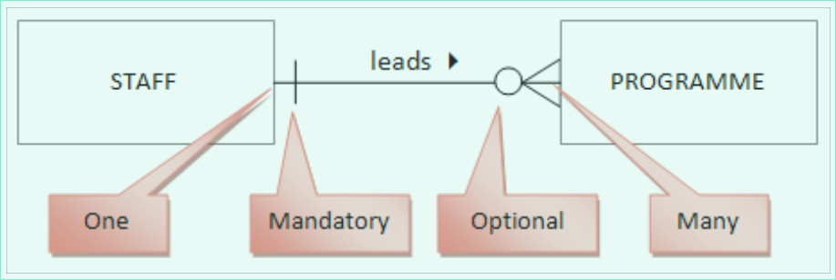
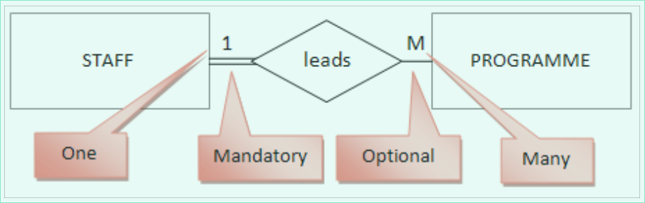
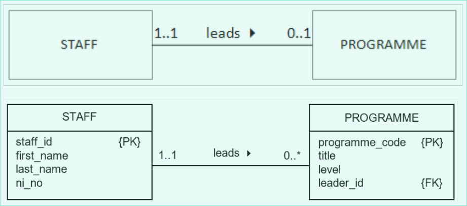
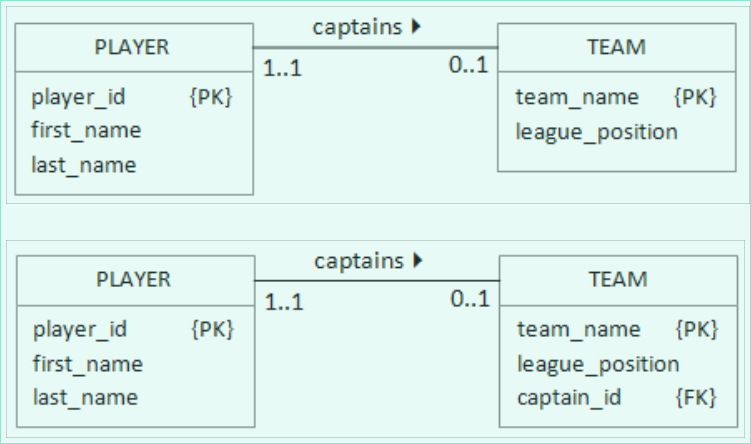

# Entity relationship diagrams

> Joe L, 40417692

---

## Crows feet diagrams

## Chen diagrams

## UML (Universal Modelling Language)

> Notice that there are no arrows on the lines. That is becasue the relationship is bi-directional. The only arrow belongs to the label.

### One to many relationships ( `1:*` )

A foreign key always corresponds to a primary key in another table. The foreign key is always at the "many" end of a relationship.

### Many to many relationships ( `*:*` )

The link table is at the "many" end of both relationships. The link table may consist only of foreign keys.

### One to one relationships: mandatory at both ends ( `1:1` )

When there is a one to one relationship the two tables could be combined into one.

Don't combine if:

- The two entity types represent different entities in the real world
- The entities participate in very different relationships with other entities
- A combined entity would slow down some database operations

One to one relationships can be mandatory or optional.

