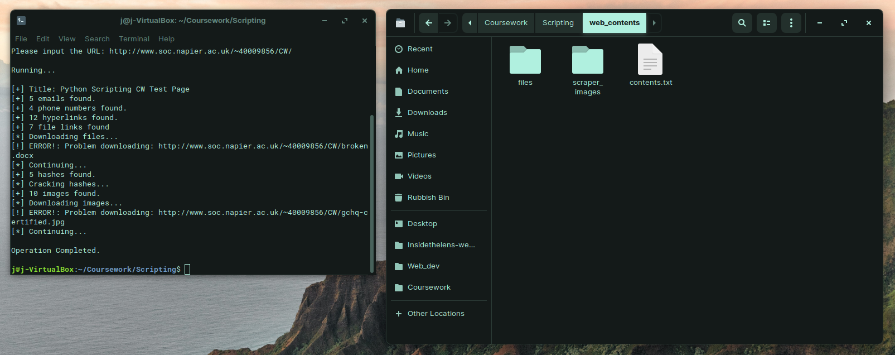
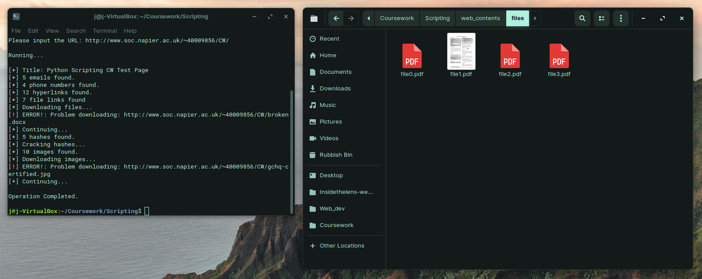
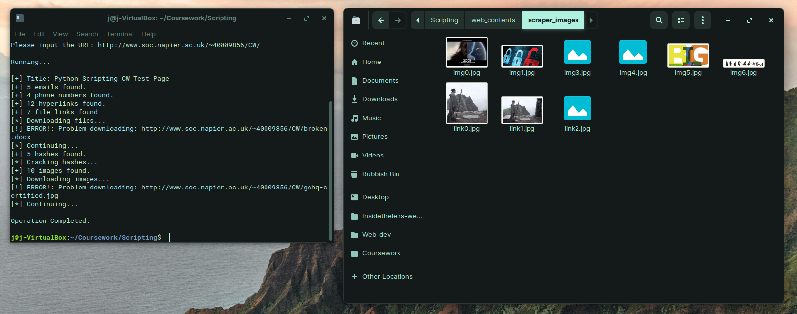
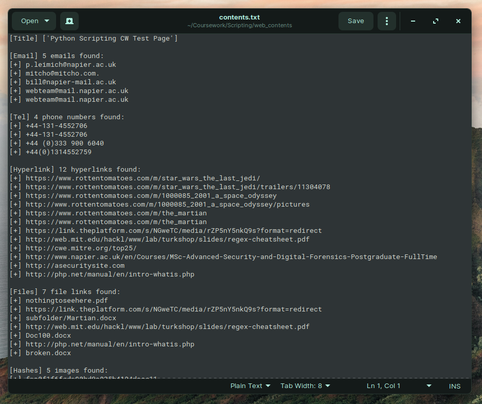

# CSN08714 2018-9 TR2 - Scripting for Cybersecurity and Networks

## Table of Contents

- [CSN08714 2018-9 TR2 - Scripting for Cybersecurity and Networks](#CSN08714-2018-9-TR2---Scripting-for-Cybersecurity-and-Networks)
  - [Table of Contents](#Table-of-Contents)
  - [Introduction](#Introduction)
  - [Structure](#Structure)
  - [Regex](#Regex)
  - [Exception Handling](#Exception-Handling)
  - [Automated preparation of the downloads directory](#Automated-preparation-of-the-downloads-directory)
  - [Dependency Diagram](#Dependency-Diagram)
  - [Functional Requirements](#Functional-Requirements)
  - [Code](#Code)
  - [Screenshots](#Screenshots)
    - [Running Script](#Running-Script)
    - [Inside Web_Contents file](#Inside-WebContents-file)
    - [Downloaded files](#Downloaded-files)
    - [Downloaded Images](#Downloaded-Images)
    - [Contents.txt](#Contentstxt)
      - [Copy of text](#Copy-of-text)

## Introduction

This is a report for my scripting coursework which required me to create a web-scraping program in python. I have been given a test web-page to test my script on and see if it is fully functional. Throughout the report I will explain parts of my code and criticise other parts. Throughout the report I will refer to regex. We were required to scrape the data using regex so I will make clear how regex is used in my script and explain how it works.

## Structure

I have tried to separate my code into as many functions as needed in order to make my code more efficient and also more readable. I have a separate function of reach regular expression and each action the program needs to perform. One function is used to iterate through every other function in the correct order in order to achieve the desired output.

## Regex

My most complex regular expression is the regex that relates to scraping all phone-numbers from the HTML text. The reason for this is due to the range of different formats a phone-number can be in. I have explained this point further in point 6 of the functional requirements below.

For now I will explain how this regular expression works.

```python
p = re.compile(r'(\+44[\s(\d)-]*[\d]+)', re.I)
```

In order to parse data using a regular expression one first needs to declare it as a variable. This is why I have wrote "`p = ...`". Next "`re.compile()`" is required to place the regex within the brackets.

Moving onto the regex syntax itself the "`\`" makes a special character used within regex syntax redundant and makes the regex search for that symbol. This is why I have placed a backslash before the "`+44`" so that I can find a "`+44`" within the text. A "`+`" symbol would usually mean find one or more of the character preceding it. Next, placed within the square brackets, is "`\s(\d)-`". Due to the square brackets and the asterisk following on from this, this part of the expression will look for any white space (symbolised by the "`\s`"), digits (symbolised by the "`\d`") or any hyphens. The asterisk means it will look for zero or more of these characters. Finally the expression looks for one ore more digits.

This regular expression could be improved as it may miss certain types of telephone numbers, however at this time I cannot think how.

## Exception Handling

My overall approach to exception handling consisted of thinking what could go wrong with my code if something was not found or input properly and putting an exception in place so that the whole program will still run but just skip past what would normal crash the program or cause issues.

Here is an example of some exception handling in my code:

```python
while imgCounter < len(images):
        urlImage = (str(url) + images[imgCounter])
        try:
            urllib.request.urlretrieve(urlImage, "web_contents/scraper_images/img%s.jpg" % imgCounter)
        except:
            print(f'[!] ERROR!: Problem downloading: {urlImage}')
            print(f'[*] Continuing...')
        imgCounter += 1
```

As you cans see, the code tries to download an image that the program has found using regex. If the file cannot download for any reason then the program outputs an Error message to the console and continues onto the next image.

## Automated preparation of the downloads directory

In order to download the files and store them in a convenient location, a downloads directory for both the files and images will need to be created. This is performed by the program automatically and this is how it is completed:

```python
try:
        os.mkdir('web_contents')
    except(FileExistsError):
        pass
    try:
        os.mkdir('web_contents/scraper_images')
    except(FileExistsError):
        pass
    try:
        os.mkdir('web_contents/files')
    except(FileExistsError):
        pass
```

The program first of all tries to create the file but if the file exists the console would usually crash with an error message stating the file exists. I have used this in my exception statement and if the file exists then the program will just continue.

## Dependency Diagram

```sh
Scraper.py -->    main()
                    |
                    |
               regex(url, f) -->  title(htmltext, f)
                                        |
                                        |
                                emails(htmltext, f)
                                        |
                                        |
                             phoneNumbers(htmltext, f)
                                        |
                                        |
                              hyperlink(htmltext, f)
                                        |
                                        |
                             files(htmltext,f, url) --> fileDownload()
                                        |
                                        |
                               hashes(htmltext, f) --> dictCrack()
                                        |
                                        |
                            images(htmltext, url, f) --> imageDownload()
```

## Functional Requirements

**1. All output from the script must be written to a txt file, using suitable sub headings and structure.**

Throughout my various functions I write strings to the contents.txt file. In my main function I first create the path, then I open the file for writing and reading before writing to the file the contents in which I have parsed from the HTML text.

```python
path = "web_contents/contents.txt"

f = open(path, 'w+')

f.write("[+] %s\n" % x)
```

**2. Read the source code of a Webpage for which you are given the URL. This must be specified as a variable so it can easily be passed to parsing functions and replaced by another URL.**

For this, I use the following code to pass my URL as a variable so that it can be used throughout my code in various functions.

```python
url = input("Please input the URL: ")
```

**3. Parse the webpage content to extract the URLs of all page hyperlinks on the page. This should output a list of all the unique hyperlinks found and a summary that states "x hyperlinks found". Both absolute and relative links should be extracted.**

This was the first function that started a trend throughout all the web scraping functions. They all work very similarly but differ when it comes to the regex used.

The regex in this function focuses on a key part of HTML documents - the attributes. It looks for the "href" attribute and selects all the text that follows it.

```python
def hyperlink(htmltext, f):

    h = re.compile(r'href="(http[s]{0,1}://.*)"', re.I)
    link = h.findall(htmltext)

    if link:
        print(f'[+] {len(link)} hyperlinks found.')
        f.write("\n[Hyperlink] %s hyperlinks found:\n" % len(link))
        for link_extract in link:
            f.write("[+] %s\n" % link_extract)
    else:
        print(f'[+] {len(link)} hyperlinks found.')
```

**4. Parse the webpage content to extract the filenames of all image files, docx and pdf files linked on the webpage. This should output separate lists of all the image files and documents found and a summary stating how many were found. Both absolute and relative links should be extracted.**

I was able to download the images fairly efficiently and effectively but struggled when it came to the documents. This was mainly due to the varied range of popular file formats used in HTML 5.

```python
def images(htmltext, url, f):

    img = re.compile(r'<img src="([\$-_\.\+!\*\'(),\w]*)"', re.I)
    images = img.findall(htmltext)

    if images:
        print(f'[+] {len(images)} images found.')
        f.write("\n[Images] %s images found.\n" % len(images))
        for img_extract in images:
            f.write("[+] %s\n" % img_extract)
        imageDownload(images, url)
    else:
        print(f'[+] {len(images)} images found.')

def files(htmltext, f, url):

    fi = re.compile(r'href="(.+[.docx|.pdf|.php|.doc|.txt]+)"', re.I)
    files = fi.findall(htmltext)

    if files:
        print(f'[+] {len(files)} file links found')
        f.write("\n[Files] %s file links found:\n" % len(files))
        for files_extract in files:
            f.write("[+] %s\n" % files_extract)
        fileDownload(files, url)
    else:
        print(f'[+] {len(files)} file links found.')
```

**5. Parse the webpage content to extract all email addresses included on the page. This should output a nicely formatted list of all the unique email addresses found and a summary that states "x email addresses found". Ideally, you should distinguish addresses found in "mailto:" fields from those included in free text.**

The email addresses are fairly easy to extract so long as they follow the '__@\__.com/.co.uk' format.

```python
def emails(htmltext, f):

    e = re.compile(r'([a-zA-Z0-9_.+-]+@[a-zA-Z0-9-]+\.[a-zA-Z0-9-.]+)', re.I)
    emails = e.findall(htmltext)

    if emails:
        print(f'[+] {len(emails)} emails found.')
        f.write("\n[Email] %s emails found:\n" % len(emails))
        for emails_extract in emails:
            f.write("[+] %s\n" % emails_extract)
    else:
        print(f'[+] {len(emails)} emails found.')
```

**6. Parse the webpage content to extract all phone numbers shown on the page. This should output a list of all the unique numbers found and a summary that states "x phone numbers found". Phone numbers of all common formats should be extracted.**

To complete this part of the code I had to try and cater for a range of telephone number formats for example the number "07495813770" could be in any of the following formats and still be a common format for a telephone number:

- 07495 813 770
- +447495813770
- +447495 813 770
- +44 7495 813 770
- +44 7495813770
- 07495-813-770
- +44-7495-813-770
- +447495-813-770

This made it difficult to make sure that I scraped all of the telephone numbers from the HTML text. It can probably be done more efficiently but this is what I came up with:

```python
def phoneNumbers(htmltext, f):

    p = re.compile(r'(\+44[\s(\d)-]*[\d]+)', re.I)
    phone = p.findall(htmltext)

    if phone:
        print(f'[+] {len(phone)} phone numbers found.')
        f.write("\n[Tel] %s phone numbers found:\n" % len(phone))
        for phone_extract in phone:
            f.write("[+] %s\n" % phone_extract)
    else:
        print(f'[+] {len(phone)} phone numbers found.')
```

**7. The webpage may contain md5 hashes of passwords hidden in the source code. Extract these and output them in a suitable format. After you have found hashes, attempt to crack them. Use a separate function / module for this. For this you need a word list of common passwords - you may use the one given as part of an earlier lab, or one of the more comprehensive lists available online. The output should list each hash found and next to it the cracked password or "no matching password found".**

To complete this task I first of all found all of the hashes and next I tried to crack them using a dictionary attack. My dictionary contains lots of common passwords and their hashes and this is compared with the hash of the password that has been found. If there is a match then this is printed to the Contents.txt file.

```python
def hashes(htmltext, f):

    s = re.compile(r'[a-f0-9]{32}', re.I)
    hashes = s.findall(htmltext)

    if hashes:
        print(f'[+] {len(hashes)} hashes found.')
        print(f'[*] Cracking hashes...')
        f.write("\n[Hashes] %s images found:\n" % len(hashes))
        for hash_extract in hashes:
            f.write("[+] %s\n" % hash_extract)
            dictCrack(hash_extract, f)
    else:
        print(f'[+] {len(hashes)} hashes found.')

def dictCrack(hash_extract, f):

    dic = ['123', '1234', '12345', '123456', '1234567', '12345678',
    'password', 'qwerty', 'abc', 'abcd', 'abc123', '111111',
    'monkey', 'arsenal', 'letmein', 'trustno1', 'dragon',
    'baseball', 'superman', 'iloveyou', 'starwars',
    'montypython', 'cheese', '123123', 'football', 'batman']

    hashes = [hashlib.md5(each_line.encode('utf-8')).hexdigest() for each_line in dic]

    dict1 = dict(zip(dic, hashes))

    rainbow = {hashes:dic for dic, hashes in dict1.items()}

    passwdFound = rainbow.get(hash_extract)

    if passwdFound:
        f.write('[+] Password recovered: %s\n' % passwdFound)
    else:
        f.write('[-] Password not recovered\n')
```

## Code

```python
# ─── WEB SCRAPER - PYTHON SCRIPT ────────────────────────────────────────────────
# ─── JOE L ──────────────────────────────────────────────────────────────────────
# ─── 40417692 ───────────────────────────────────────────────────────────────────
'''
A webscraper that, when ran, will scarpe details from a web page. The details it
collects are as follows:
    - The title
    - Any email addresses
    - Any phone numbers
    - Any hyperlinks
    - Any files
    - Any md5 hashes
    - Any images

The script will then attempt to download the files and store them in /web_contents/files,
download the images and store them in web_contents/ scarper_images and dictionary attack
the md5 hashes.

All web content found will be listed in web_contents/contents.txt.

This script should only be ran in Python version 3.6.
'''
import urllib.request
import urllib
import re
import os
import sys
import hashlib


# ────────────────────────────────────────────────────────────────────────────────
# ─── HASH CRACK FUNCTION ────────────────────────────────────────────────────────
# ────────────────────────────────────────────────────────────────────────────────
def dictCrack(hash_extract, f):

    # List of common passwords.
    dic = ['123', '1234', '12345', '123456', '1234567', '12345678',
    'password', 'qwerty', 'abc', 'abcd', 'abc123', '111111',
    'monkey', 'arsenal', 'letmein', 'trustno1', 'dragon',
    'baseball', 'superman', 'iloveyou', 'starwars',
    'montypython', 'cheese', '123123', 'football', 'batman']

    # Uses hashlib to md5 hash the list of common passwords.
    hashes = [hashlib.md5(each_line.encode('utf-8')).hexdigest() for each_line in dic]

    # dict1 is a dictionary that is created from the passwords and hashes zipped together.
    dict1 = dict(zip(dic, hashes))

    # A rainbow table is created from this.
    rainbow = {hashes:dic for dic, hashes in dict1.items()}

    # Match the password to the hash that has been extracted from the website.
    passwdFound = rainbow.get(hash_extract)

    # Write to console "Password recovered" if password has been found.
    if passwdFound:
        f.write('[+] Password recovered: %s\n' % passwdFound)
    else:
        f.write('[-] Password not recovered\n')


# ────────────────────────────────────────────────────────────────────────────────
# ─── FILE DOWNLOAD FUNCTION ─────────────────────────────────────────────────────
# ────────────────────────────────────────────────────────────────────────────────
def fileDownload(files, url):

    fileCounter = 0
    fileLinkCounter = 0
    fileLinkList = []

    print(f'[*] Downloading files...')

    # Picks out the absolute links from the files list.
    for line in files:
        fLink = re.compile(r'http[s]{0,1}://.*')  # Regex - Finds all "HTTP or HTTPS" links.
        fileLink = fLink.findall(line)
        if fileLink: 
            fileLinkList.append(fileLink)

    # Downloads absolute links found from files list.
    for fileLink in fileLinkList:
        fListStrip = str(fileLinkList[fileLinkCounter]).strip('[\'\']')
        files.remove(fListStrip)  # Removes absolute file links from files list.
        try:
            urllib.request.urlretrieve(fListStrip, "web_contents/files/file%s.pdf" % fileLinkCounter)
        except:
            print(f'[!] ERROR! Problem downloading file. Continuing...')
        fileLinkCounter += 1

    # Downloads relative file links from files list.
    while fileCounter < len(files):
        urlFile = (str(url) + files[fileCounter])
        try:
            urllib.request.urlretrieve(urlFile, "web_contents/files/file%s.pdf" % fileLinkCounter)
        except:
            print(f'[!] ERROR!: Problem downloading: {urlFile}')
            print(f'[*] Continuing...')
        fileCounter += 1


# ────────────────────────────────────────────────────────────────────────────────
# ─── IMAGE DOWNLOAD FUNCTION ────────────────────────────────────────────────────
# ────────────────────────────────────────────────────────────────────────────────
def imageDownload(images, url):

    imgCounter = 0
    linkCounter = 0
    linkList = []

    print(f'[*] Downloading images...')

    # For every line in images, this function separates the absolute file paths from the 
    # relative file paths.
    for line in images:
        iLink = re.compile(r'http[s]{0,1}://.*')  # Uses regex to separate absolute file paths.
        imgLink = iLink.findall(line)
        if imgLink: 
            linkList.append(imgLink)

    for link in linkList:

        # linklist is a list so this lone strips the [' '] from the string in order to run properly.
        lListStrip = str(linkList[linkCounter]).strip('[\'\']')
        images.remove(lListStrip) # Removes absolute file paths from images list. 
        try:
            urllib.request.urlretrieve(lListStrip, "web_contents/scraper_images/link%s.jpg" % linkCounter)
        except(FileNotFoundError):
            print(f'[!] ERROR!: Image folder does not exist. Creating folder...')
            os.mkdir('web_contents/scraper_images')
        linkCounter += 1

    # Downloads the relative files by concatinating them to the URL and downloading them like above.
    while imgCounter < len(images):
        urlImage = (str(url) + images[imgCounter])
        try:
            urllib.request.urlretrieve(urlImage, "web_contents/scraper_images/img%s.jpg" % imgCounter)
        except:
            print(f'[!] ERROR!: Problem downloading: {urlImage}')
            print(f'[*] Continuing...')
        imgCounter += 1


# ────────────────────────────────────────────────────────────────────────────────
# ─── TITLE - REGEX ──────────────────────────────────────────────────────────────
# ────────────────────────────────────────────────────────────────────────────────
def title(htmltext, f):
    
    # Regex used to find the title. Relies on the HTML tags to find this.
    t = re.compile(r'<title.*>\s*(.*)\s*?</title>', re.I)
    titles = t.findall(htmltext)
    i = 0

    # If any titles are found, print the title to the .txt document and write to 
    # console how many were found. (Should only be one)
    if titles:
        for title in titles:
            # f strings were introduced into python 3.6 as a way of printing strings to the console.
            print(f'[+] Title: {titles[i]}')
            f.write("[Title] %s\n" % titles)
            i += 1
    else:
        f.write('[+] Title: None')


# ────────────────────────────────────────────────────────────────────────────────
# ─── EMAILS - REGEX ─────────────────────────────────────────────────────────────
# ────────────────────────────────────────────────────────────────────────────────
def emails(htmltext, f):

    # Regex to find email addresses in the HTML text. Relies on the email being in a ___@___.___ format.
    e = re.compile(r'([a-zA-Z0-9_.+-]+@[a-zA-Z0-9-]+\.[a-zA-Z0-9-.]+)', re.I)
    emails = e.findall(htmltext)

    # If any emails are found, print the emails found to the .txt document and write to 
    # console how many were found.
    if emails:
        print(f'[+] {len(emails)} emails found.')
        f.write("\n[Email] %s emails found:\n" % len(emails))
        for emails_extract in emails:
            f.write("[+] %s\n" % emails_extract)
    else:
        print(f'[+] {len(emails)} emails found.')


# ────────────────────────────────────────────────────────────────────────────────
# ─── PHONE NUMBERS - REGEX ──────────────────────────────────────────────────────
# ────────────────────────────────────────────────────────────────────────────────
def phoneNumbers(htmltext, f):

    # Regex to find all phone numbers.
    p = re.compile(r'(\+44[\s(\d)-]*[\d]+)', re.I)
    phone = p.findall(htmltext)

    # If any Phone numbers are found, print the numbers found to the .txt document and write to 
    # console how many were found.
    if phone:
        print(f'[+] {len(phone)} phone numbers found.')
        f.write("\n[Tel] %s phone numbers found:\n" % len(phone))
        for phone_extract in phone:
            f.write("[+] %s\n" % phone_extract)
    else:
        print(f'[+] {len(phone)} phone numbers found.')


# ────────────────────────────────────────────────────────────────────────────────
# ─── HYPERLINK - REGEX ──────────────────────────────────────────────────────────
# ────────────────────────────────────────────────────────────────────────────────
def hyperlink(htmltext, f):

    # Regex to find all hyperlinks. Relies on hyperlink beginning with HTTP or HTTPS.
    h = re.compile(r'href="(http[s]{0,1}://.*)"', re.I)
    link = h.findall(htmltext)

    # If any hyperlinks are found, print the links found to the .txt document and write to 
    # console how many were found.
    if link:
        print(f'[+] {len(link)} hyperlinks found.')
        f.write("\n[Hyperlink] %s hyperlinks found:\n" % len(link))
        for link_extract in link:
            f.write("[+] %s\n" % link_extract)
    else:
        print(f'[+] {len(link)} hyperlinks found.')


# ────────────────────────────────────────────────────────────────────────────────
# ─── HYPERLINK - REGEX ──────────────────────────────────────────────────────────
# ────────────────────────────────────────────────────────────────────────────────
def files(htmltext, f, url):

    # Regex to find all files in the html text. Relies on the file ending with
    # either of the following formats: .docx, .doc, .pdf, .php or .txt.
    fi = re.compile(r'href="(.+[.docx|.pdf|.php|.doc|.txt]+)"', re.I)
    files = fi.findall(htmltext)

    # If any files are found, print the files found to the .txt document and write to 
    # console how many were found.
    # Proceed to run the filesDownload function to download the files.
    if files:
        print(f'[+] {len(files)} file links found')
        f.write("\n[Files] %s file links found:\n" % len(files))
        for files_extract in files:
            f.write("[+] %s\n" % files_extract)
        fileDownload(files, url)
    else:
        print(f'[+] {len(files)} file links found.')


# ────────────────────────────────────────────────────────────────────────────────
# ─── HASHES - REGEX ─────────────────────────────────────────────────────────────
# ────────────────────────────────────────────────────────────────────────────────
def hashes(htmltext, f):

    # Regex to find all hashes. Relies on the hash being an md5 hash, 32 characters long
    # and in hex format.
    s = re.compile(r'[a-f0-9]{32}', re.I)
    hashes = s.findall(htmltext)

    # If any hashes are found, print the hashes found to the .txt document and write to 
    # console how many were found.
    # Proceed to run the dictCrack function to crack the hashes with a dictionary attack.
    if hashes:
        print(f'[+] {len(hashes)} hashes found.')
        print(f'[*] Cracking hashes...')
        f.write("\n[Hashes] %s images found:\n" % len(hashes))
        for hash_extract in hashes:
            f.write("[+] %s\n" % hash_extract)
            dictCrack(hash_extract, f)
    else:
        print(f'[+] {len(hashes)} hashes found.')


# ────────────────────────────────────────────────────────────────────────────────
# ─── IMAGES - REGEX ─────────────────────────────────────────────────────────────
# ────────────────────────────────────────────────────────────────────────────────
def images(htmltext, url, f):

    # Regex to find all images in text file. Relies on the  HTML tag.
    img = re.compile(r'<img src="([\$-_\.\+!\*\'(),\w]*)"', re.I)
    images = img.findall(htmltext)

    # If any images are found, print the images found to the .txt document and write to 
    # console how many were found.
    # Proceed to run the imagesDownload function to download the images.
    if images:
        print(f'[+] {len(images)} images found.')
        f.write("\n[Images] %s images found.\n" % len(images))
        for img_extract in images:
            f.write("[+] %s\n" % img_extract)
        imageDownload(images, url)
    else:
        print(f'[+] {len(images)} images found.')


# ────────────────────────────────────────────────────────────────────────────────
# ─── RUN REGEX FUNCTIONS ────────────────────────────────────────────────────────
# ────────────────────────────────────────────────────────────────────────────────
def regex(url, f):

    # a funstion purley for running the functions in order.
    htmlfile = urllib.request.urlopen(url)
    htmltext = htmlfile.read().decode("utf-8")
    title(htmltext, f)
    emails(htmltext, f)
    phoneNumbers(htmltext, f)
    hyperlink(htmltext, f)
    files(htmltext,f, url)
    hashes(htmltext, f)
    images(htmltext, url, f)


# ────────────────────────────────────────────────────────────────────────────────
# ─── MAIN ───────────────────────────────────────────────────────────────────────
# ────────────────────────────────────────────────────────────────────────────────
def main():
    
    # URL to be used:
    url = input("Please input the URL: ")

    # Checks if directories exist, if not then create them.
    # Multiple try and exepts as I wouldn't want a directory to be skipped past.
    try:
        os.mkdir('web_contents')
    except(FileExistsError):
        pass
    try:
        os.mkdir('web_contents/scraper_images')
    except(FileExistsError):
        pass
    try:
        os.mkdir('web_contents/files')
    except(FileExistsError):
        pass
    
    # Creates the path in which to find the contents.txt file.
    path = "web_contents/contents.txt"

    # Opens file and runs all other functions.
    f = open(path, 'w+')
    print(f'\nRunning...\n')

    try:
        regex(url, f)
        print(f'\nOperation Completed.\n')
    except:
        print(f'[!] ERROR!: Invalid URL, please try again...')


if __name__ == '__main__':
    main()
```

## Screenshots

### Running Script


### Inside Web_Contents file



### Downloaded files



### Downloaded Images



### Contents.txt



#### Copy of text

[Title] ['Python Scripting CW Test Page']

[Email] 5 emails found:
[+] p.leimich@napier.ac.uk
[+] mitcho@mitcho.com.
[+] bill@napier-mail.ac.uk
[+] webteam@mail.napier.ac.uk
[+] webteam@mail.napier.ac.uk

[Tel] 4 phone numbers found:
[+] +44-131-4552706
[+] +44-131-4552706
[+] +44 (0)333 900 6040
[+] +44(0)1314552759

[Hyperlink] 12 hyperlinks found:
[+] https://www.rottentomatoes.com/m/star_wars_the_last_jedi/
[+] https://www.rottentomatoes.com/m/star_wars_the_last_jedi/trailers/11304078
[+] https://www.rottentomatoes.com/m/1000085_2001_a_space_odyssey
[+] http://www.rottentomatoes.com/m/1000085_2001_a_space_odyssey/pictures
[+] https://www.rottentomatoes.com/m/the_martian
[+] https://www.rottentomatoes.com/m/the_martian
[+] https://link.theplatform.com/s/NGweTC/media/rZP5nY5nkQ9s?format=redirect
[+] http://web.mit.edu/hackl/www/lab/turkshop/slides/regex-cheatsheet.pdf
[+] http://cwe.mitre.org/top25/
[+] http://www.napier.ac.uk/en/Courses/MSc-Advanced-Security-and-Digital-Forensics-Postgraduate-FullTime
[+] http://asecuritysite.com
[+] http://php.net/manual/en/intro-whatis.php

[Files] 7 file links found:
[+] nothingtoseehere.pdf
[+] https://link.theplatform.com/s/NGweTC/media/rZP5nY5nkQ9s?format=redirect
[+] subfolder/Martian.docx
[+] http://web.mit.edu/hackl/www/lab/turkshop/slides/regex-cheatsheet.pdf
[+] Doc100.docx
[+] http://php.net/manual/en/intro-whatis.php
[+] broken.docx

[Hashes] 5 images found:
[+] fea0f1f6fede90bd0a925b4194deac11
[+] Password recovered: cheese
[+] fea0f1f6fede90bd0a925b4194deac11
[+] Password recovered: cheese
[+] d1133275ee2118be63a577af759fc052
[-] Password not recovered
[+] 5badcaf789d3d1d09794d8f021f40f0e
[+] Password recovered: starwars
[+] 5fcfd41e547a12215b173ff47fdd3739
[+] Password recovered: trustno1

[Images] 10 images found.
[+] https://resizing.flixster.com/rLAoq_aX1ZYgon9StZ9358ikwnY=/300x300/v1.bjsxNzQ3MTg4O2o7MTc5MzA7MTIwMDs1NzYwOzM4NDA
[+] https://resizing.flixster.com/00zPNKDlHUNtYCEEAx3V47qxtw4=/fit-in/1152x864/v1.bjsxNzQ3MTg4O2o7MTgwMjA7MTIwMDs1NzYwOzM4NDA
[+] 2001-a-space-odyssey.JPG
[+] msc_asdf_logo.jpeg
[+] gchq-certified.jpg
[+] http://www.asecuritysite.com/content/icon_clown.gif
[+] icon_clown.gif
[+] subfolder/icon_clown.gif
[+] big.jpg
[+] monty-python-(1).bmp
