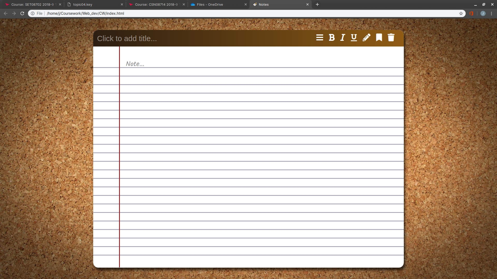

# Web Technologies

> Joe L, 40417692

- [Web Technologies](#Web-Technologies)
  - [Initial Plan](#Initial-Plan)
    - [Features](#Features)
    - [Design](#Design)
  - [Development](#Development)
    - [Final Design](#Final-Design)
    - [Save Feature](#Save-Feature)
    - [Delete Feature](#Delete-Feature)
    - [Saved Notes - Drop-down](#Saved-Notes---Drop-down)

---

## Initial Plan

For this assignment we have been asked to create a note taking application with server-side integration in order to save notes. This will have to be a user-friendly application so I will concentrate a lot on the design to make it usable and attractive.

### Features

With this web page I would like to impliment the following features.

The user should be able to:

- [ ] Create and Store new notes.
- [ ] Delete old notes.
- [ ] Text formatting - Bold, Underlined and Italics.
  - [ ] Bold
  - [ ] Underline
  - [ ] Italics
- [ ] Download notes.

### Design

My design was inspired by the Apple Inc. Notes application. I wanted to have a friendly design that was easy to use and attractive to look at. I tried to make my web application look like a classic notepad, implementing icons in the top right corner that actions will be attatched to. The icons are hopefully easy to understand with the bin which will delete the note, bookmark to save a note, pencil to create a note and file to search through saved notes.


## Development

Using my initial design as a guide, I began to create my Web application. I began by creating the white container that acts as the background for the notepad itself.

The next step was to create The top bar that I use to contain the title and options icons. One interesting aspect of this `<div>` is that only 2 corners of four are rounded. I did this by utilising the `border-radius` element in CSS.

```css
border-radius: 20px 20px 0 0;
```

As you can see the first two sizes are reletive to the top corners and the following two numbers are the bottom corners.

The next step was to add the icons, horizontal lines and vertical lines in order to finish off the aesthetic. The icons are from an online repository called FontAwesome (https://fontawesome.com/). I include the repostiory in my HTML first:

```html
<script src="https://kit.fontawesome.com/f1e8cb77c0.js"></script>
```

And choose the icons I want and put them into my HTML as:

```html
<i class="fas fa-(ICON NAME)"><i>
```


One Issue I had when writing my HTML and CSS was with the text boxes. I couldn't get the text area used to write the note located in the position I desired. I fixed this using the z-index, bringing the text box forward.

To finalise the design I changed the background to a more appealing cork-board image, Added the icons I will use for the text formatting features and added pop-up confirmation boxes to the features that will be linked to the back-end server environment (The save and delete feature).

### Final Design



As you can see, the final design is representative of the initial design but with some additional features such as the text formatting features.

### Save Feature


The save feature will be implemented in the second part of this assignment.

### Delete Feature


The delete feature will be implemented in the second part of this assignment.

### Saved Notes - Drop-down


The titles that the user inputs will be shown in the drop-down. Once clicked the note will show and can be edited.
