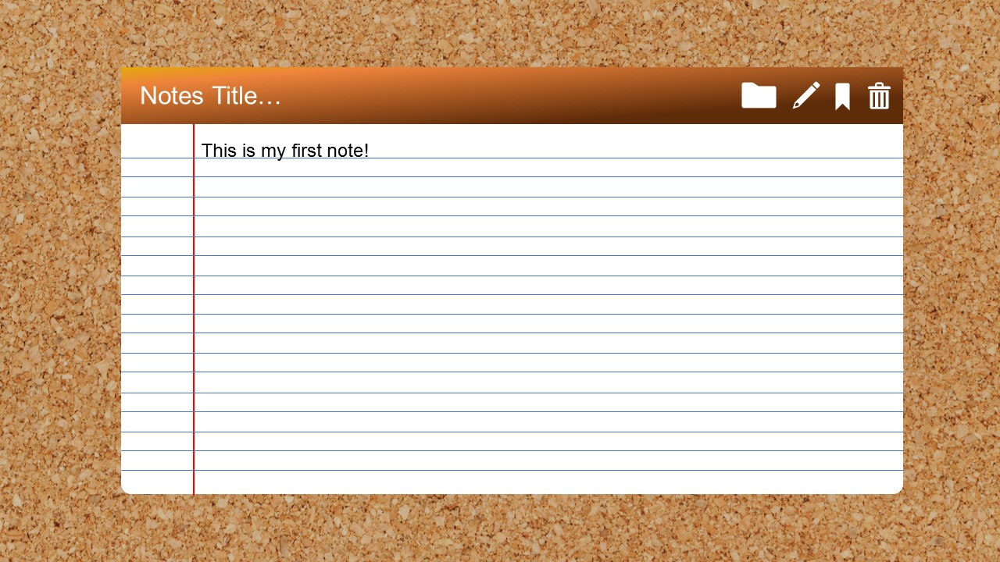
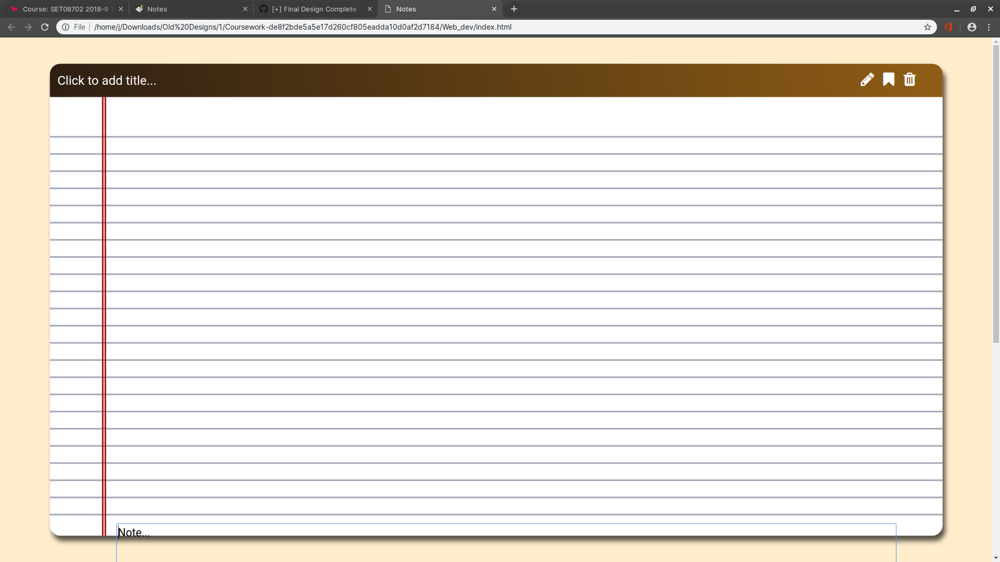
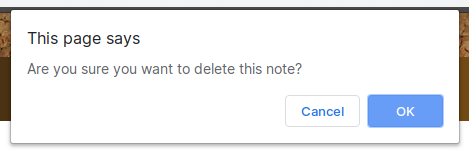
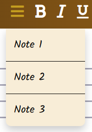

# SET08702 - Web Technologies

## Coursework part one

> Joe L, 40417692

---

## Introduction

For the first part of this coursework I have designed a note application where notes can be created, saved and edited by a user. The notes will be saved via an integrated server-based database that will be demonstrated in part two of this coursework.

## Initial Plan

I began this project by designing my application. I thought of note applications that already exist in the real world and I favoured a simple yet attractive design, taking inspiration from a physical notebook in the real world. I thought about any features I would want in a note application and wrote these down so that i could refer back to them later.

### Features

The features I initially wrote down for this application are as follows:

The user should be able to:

- [ ] Create and save new notes
- [ ] Delete old notes
- [ ] Edit stored notes
- [ ] Format text to be bold, underlined and/or italic
- [ ] Download notes

### Design

The ultimate aim for my application was to make it easy to use and visually appealing. As I have mentioned, my design has been inspired by a physical notepad. I wanted the lined paper effect to be a predominant feature and have simple yet intuitive buttons to carry out the actions associated with my implemented features.

<div style="page-break-after: always;"></div>

Screenshot | Description
--- | ---
 | This is my initial design fro my notes application. <br/>I wanted a cork-board effect as the background so that the notepad looked like it was attached to it.<br/> The icons are neatly located in the top right corner that carry the actions such as save, delete, new and open.

---

## Development

Using my initial design as a guide, I began to create my web application. I began by creating the white container that acts as the background for the notepad itself.

The next step was to create The top bar that I use to contain the title and icons. One interesting aspect of this `<div>` is that only two corners of four are rounded. I did this by utilising the `border-radius` element in CSS.

```css
border-radius: 20px 20px 0 0;
```

> As you can see the first two sizes are reletive to the top corners and the following two numbers are the bottom corners.

The next step was to add the icons, horizontal lines and vertical lines in order to finish off the aesthetic. The icons are from an online repository called FontAwesome (https://fontawesome.com/). I include the repository in my HTML first:

```html
<script src="https://kit.fontawesome.com/f1e8cb77c0.js"></script>
```

And choose the icons I wanted to use and put them into my HTML as:

```html
<i class="fas fa-(ICON NAME)"><i>
```

One noteworthy aspect of the lined-paper effect is the horizontal lines. I initially created these by just copy and pasting multiple `<div>`'s with he same class. After deciding this looked terribly unclean I wrote a JavaScript function to duplicate the same `<div>` as many times as I desired. I did this with the following code:

<div style="page-break-after: always;"></div>

**HTML**

```html
<script>lineRepeat(document.querySelector('.horizontalLine'), 22, true);</script>
```

**Javascript**

```js
function lineRepeat(line, count) {
    for (var i = 0, copy; i < count - 1; i++) {
        copy = line.cloneNode(); // Clones the horizontal lines
        line.parentNode.insertBefore(copy, line);
    }
}
```

Screenshot | Description
--- | ---
 | One Issue I had when writing my HTML and CSS was with the text boxes. I couldn't get the text area used to write the note located in the position I desired. I fixed this using the z-index, bringing the text box forward.

To finalise the design I changed the background to a more appealing cork-board image that was in my initial design, Added the icons I will use for the text formatting features, download function and menu for the saved notes and finally added pop-up confirmation boxes to the features that will be linked to the back-end server environment, this will help the user, at this stage, to navigate the in-complete application.

---

<div style="page-break-after: always;"></div>

### Screenshots

Screenshot | Description
--- | ---
 | **Final Design**<br/>As you can see, the final design is representative of the initial design but with some additional features such as the text formatting features.
 | **Save Feature**<br/>The save feature will be implemented in the second part of this assignment.
 | **Delete Feature**<br/>The delete feature will be implemented in the second part of this assignment.
 | **Dropdown Menu**<br/>The titles that the user inputs will be shown in the drop-down. Once clicked the note will show and can be edited.
