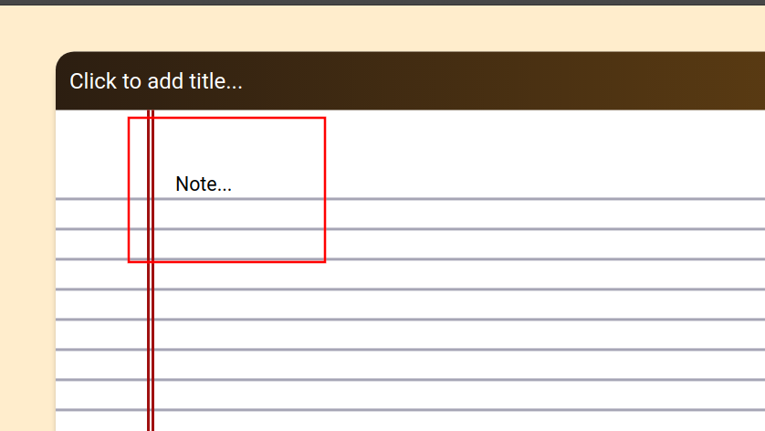
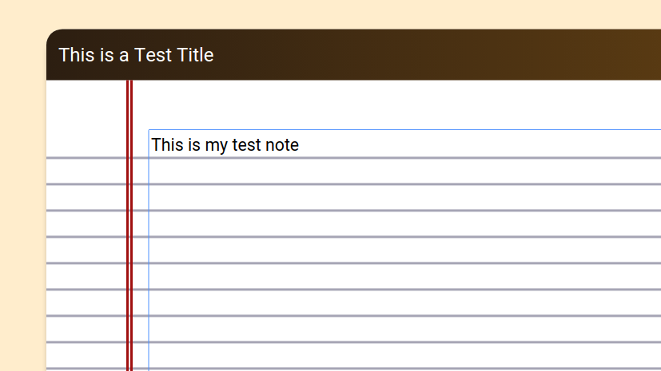
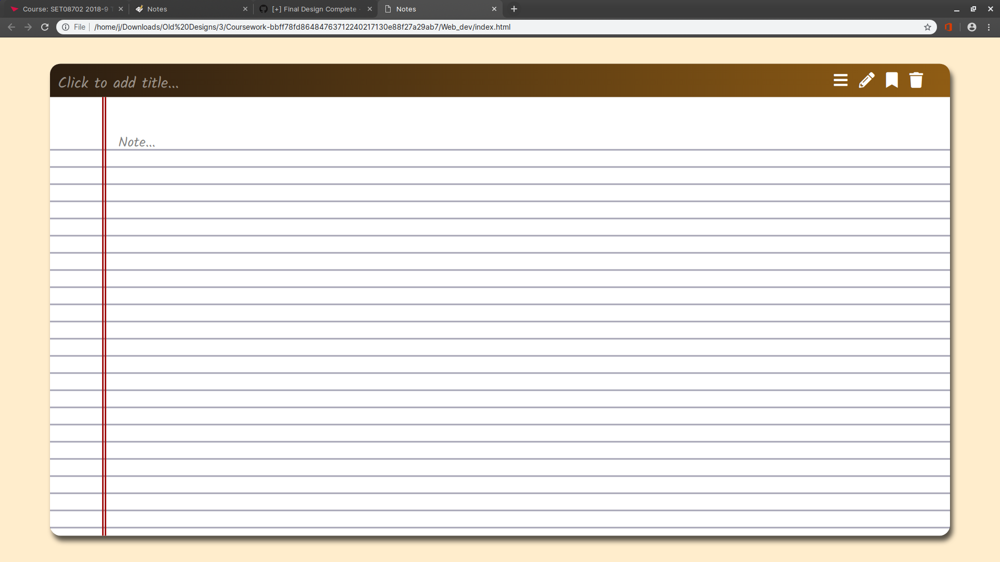
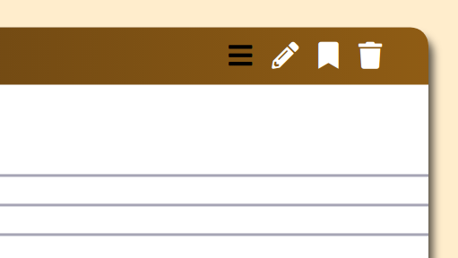
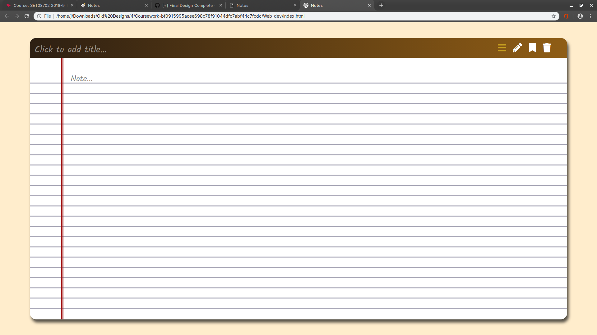
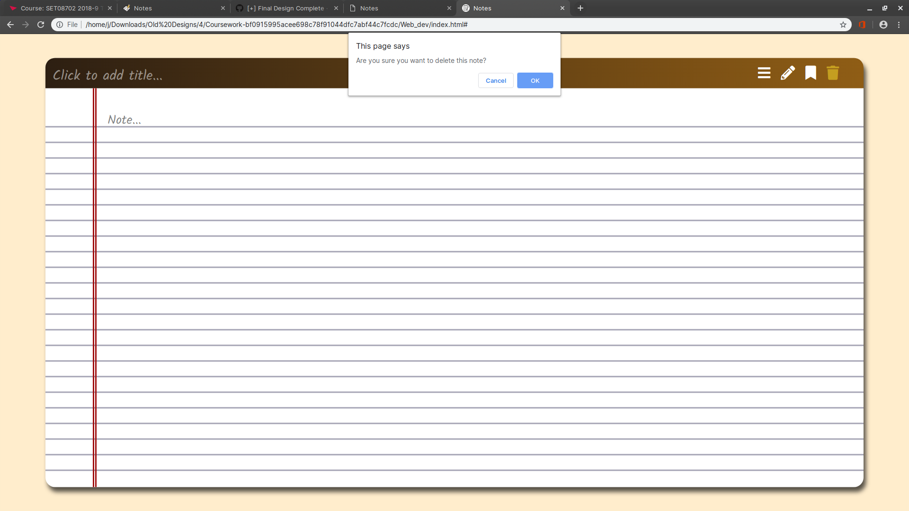
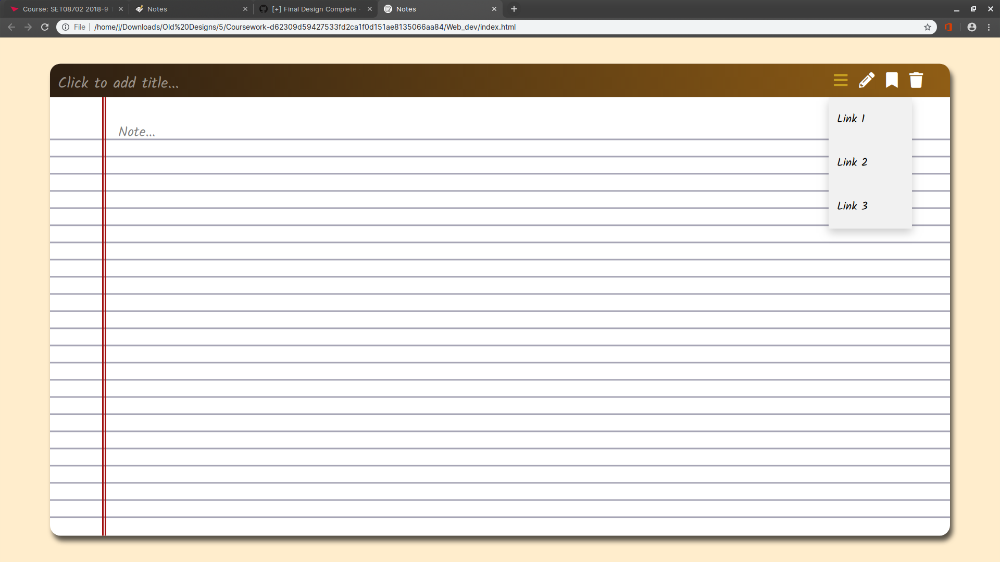
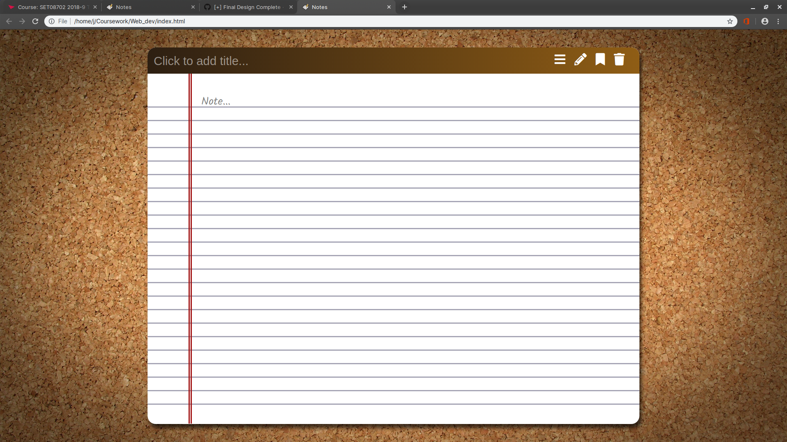
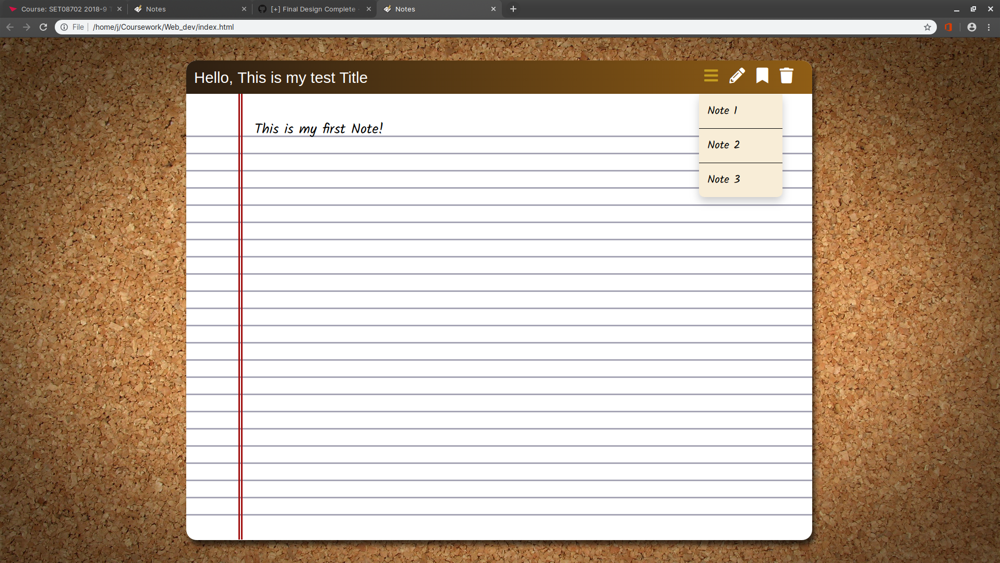
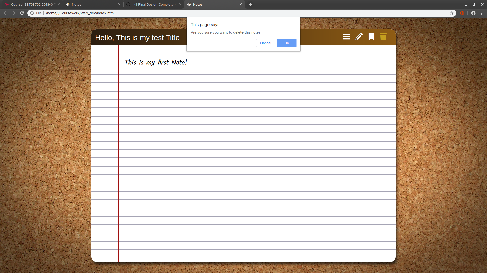

# Web Technologies

> Joe L, 40417692

- [Web Technologies](#Web-Technologies)
  - [Initial Plan](#Initial-Plan)
    - [Features](#Features)
    - [Design](#Design)
  - [Development](#Development)

---

## Initial Plan

For this assignment we have been asked to create a note taking application with server-side integration in order to save notes. This will have to be a user-friendly application so I will concentrate a lot on the design to make it usable and attractive.

### Features

With this web page I would like to impliment the following features.

The user should be able to:

- [x] Create and Store new notes.
- [x] Delete old notes.
- [ ] Download notes.

Different note styles will be available to cater for different preferences.
Different fonts will also be available.

### Design

## Development

